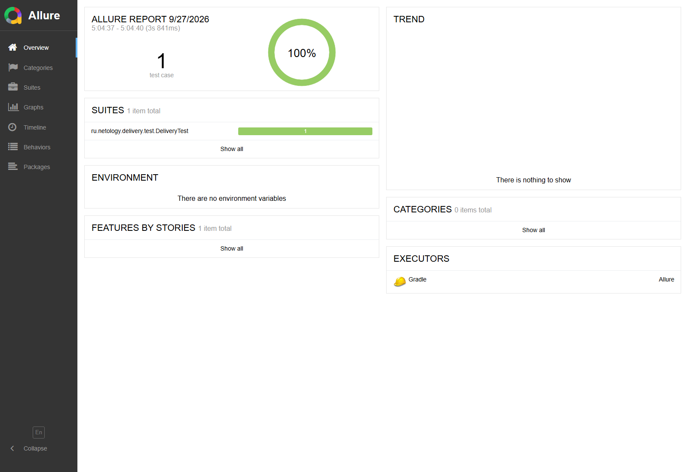

# Allure-отчёт для задания «Проснулись»

Отдельный проект с обязательным заданием № 1 из раздела Reporting. UI-тест на Java 11 проверяет планирование встречи и её перепланирование в приложении «Карта с доставкой». Для отчётности подключены Allure JUnit 5 и Allure Selenide.

## Запуск

1. Запустить приложение из корня проекта:

   ```bash
   java -jar artifacts/app-replan-delivery.jar
   ```

   Приложение будет доступно по адресу `http://localhost:9999`.

2. В другом терминале выполнить тесты и собрать Allure-отчёт:

   ```bash
   ./gradlew -Dselenide.headless=true clean test allureReport
   ```

   В PowerShell Windows команда будет такой:

   ```powershell
   .\gradlew.bat '-Dselenide.headless=true' clean test allureReport
   ```

3. Посмотреть отчёт в браузере:

   ```bash
   ./gradlew allureServe
   ```

   HTML-отчёт также находится в `build/reports/allure-report/allureReport/index.html`.

Тест проверяет текст и видимость уведомления после первого планирования, подтверждает перепланирование на новую дату и прикладывает итоговый снимок страницы. Allure Selenide настроен для прикрепления скриншотов и исходного кода страницы при ошибках.

## Пример отчёта


